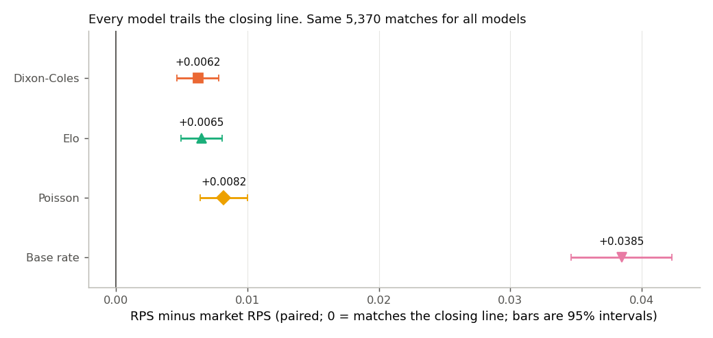
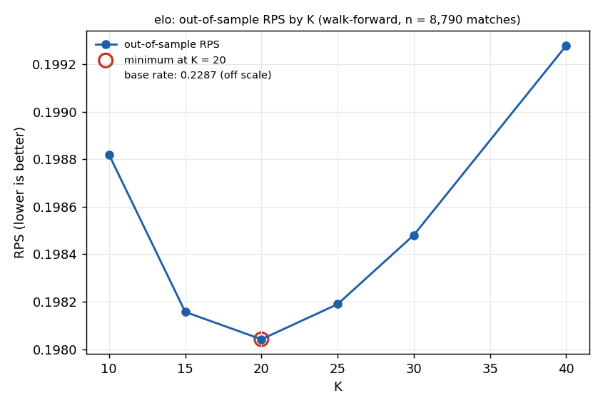
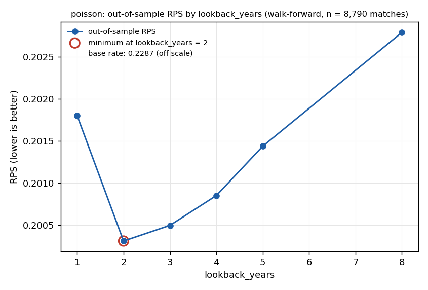
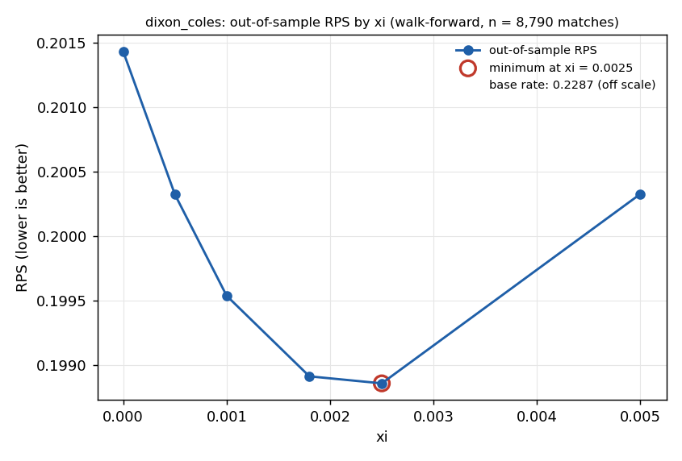
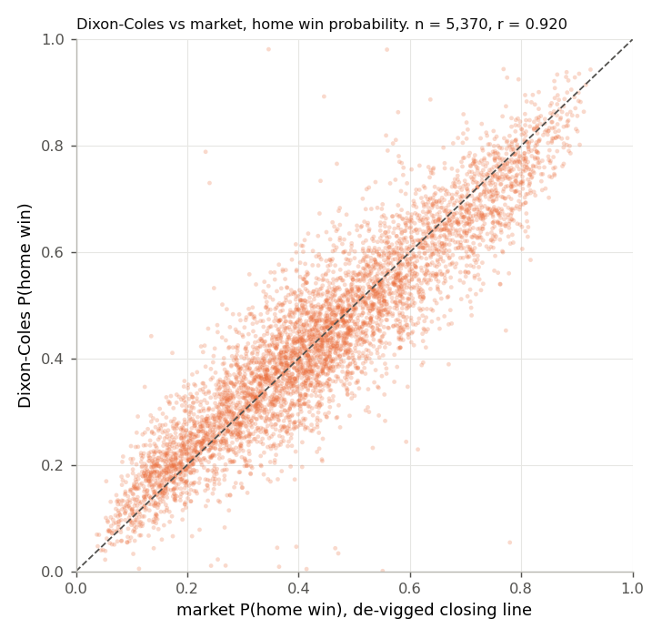
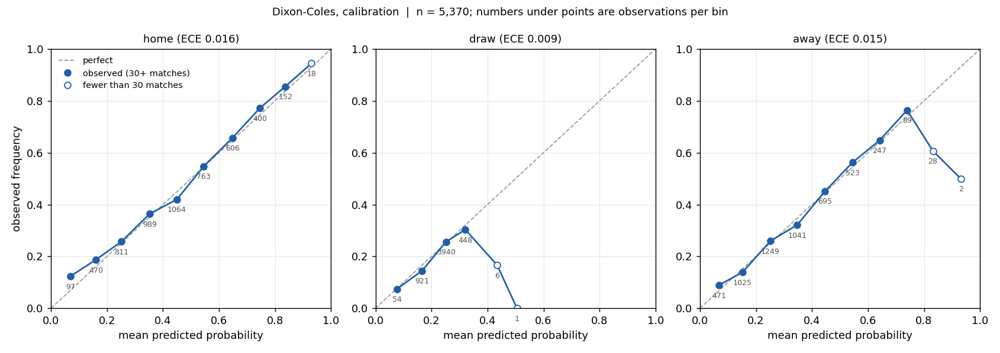
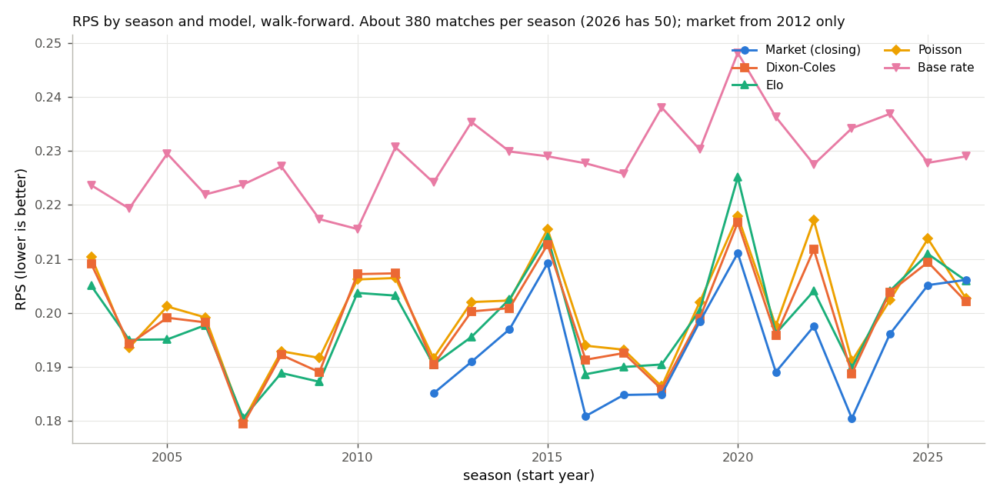

# Premier League match prediction, evaluated against the market

A probabilistic model of Premier League results (home / draw / away), judged by a walk-forward
backtest and benchmarked against de-vigged bookmaker closing prices. The deliverable is the
evaluation harness, with five models plugged into it. **None of them beats the market, and the
project does not claim otherwise.**

## Headline result

Ranked probability score (RPS, lower is better) on the 5,370 matches from 2012/13 to 2026/27 that
have closing odds. Every model is scored on exactly the same matches. The gap is paired per match, so
its standard error is much smaller than the spread between seasons.

| Model | RPS | Log loss | Brier | RPS gap to market (95% interval) |
|---|---|---|---|---|
| **Market closing line** | **0.1937** | **0.9562** | **0.5661** | n/a |
| Dixon-Coles (time decay, tau correction) | 0.1999 | 0.9781 | 0.5795 | +0.0062 (+/- 0.0016) |
| Elo (goal-difference adjusted) | 0.2002 | 0.9766 | 0.5800 | +0.0065 (+/- 0.0016) |
| Independent Poisson | 0.2019 | 0.9845 | 0.5837 | +0.0082 (+/- 0.0018) |
| Base rate (historical H / D / A frequencies) | 0.2322 | 1.0690 | 0.6466 | +0.0385 (+/- 0.0038) |

Snapshot of results as of 2026-09-20; the current season is partial and the numbers move as matches are played.

Source: `reports/model_vs_market.csv` (written from the walk-forward predictions; the same numbers
are in `reports/metrics.csv`). The market is Pinnacle's closing price for 5,150 of these matches and
the market-average closing price for the other 220. On the 5,150 Pinnacle-only matches the picture is
the same: market 0.1930, Dixon-Coles 0.1993, Elo 0.1995, Poisson 0.2012, base rate 0.2323.



The best statistical model is about 0.006 RPS behind the closing line. The market was better in 14
of the 15 seasons 2012/13 to 2026/27; the exception is 2026/27, which only has 50 matches so far.

## Evaluation method

`src/evaluate.py` is the only place metrics are computed. RPS is the headline because home / draw /
away are ordered: calling a home win an away win costs more than calling it a draw. Log loss and Brier
score are reported alongside it and the market's values sit next to every model's. No hit-rate style
metric is reported anywhere, because it ignores how confident a forecast was.

- **Walk-forward, never a random split.** `src/backtest.py` refits every model from scratch at each
  matchweek on matches dated strictly before that matchweek's first kick-off. The first three seasons
  (2000/01 to 2002/03) are training only, so scoring covers 8,790 matches from 2003/04. A model is handed
  fixtures with no result columns.
- **Leakage is tested, not assumed** (`tests/test_leakage.py`). Features are bit-identical when future
  rows are deleted; `fit` never sees a row dated on or after the prediction date; scrambling every result
  from a chosen date onwards leaves all earlier predictions unchanged (run against every registered model);
  a model that reads the result of the match it predicts fails outright. The scrambling test was checked to
  have teeth: a deliberately leaky model fails it.
- **Hyperparameters are tuned out of sample, without look-ahead.** For each tuned parameter (Elo's K,
  Poisson's lookback window, Dixon-Coles' xi) every grid value is run through the full walk-forward. The
  value used to predict a given season is the one with the best RPS over earlier seasons only. Each tuning
  run writes its curve to `reports/figures/`.
- **Same subset for any comparison with the market.** Closing odds start in 2012/13, so the benchmark
  covers 2012/13 onwards; earlier seasons train the models but cannot benchmark them. Pinnacle closing
  prices stop after 2026-01-08, so the market-average closing price is the fallback and the source is
  recorded on every match.
- **De-vigging.** Two methods are implemented: proportional normalisation (the default) and Shin. On the
  same 5,370 matches they are indistinguishable (RPS 0.19372 against 0.19371, log loss 0.956244 against
  0.956239), so the choice does not affect any conclusion.
- **Deterministic.** Two complete rebuilds (the first from an empty `data/` folder, raw files re-downloaded; every
  model re-run both times) produced byte-identical `reports/`, figures included. Every metrics row carries a hash of `config.yaml`.

## Model ladder

**Base rate.** Predicts the historical home / draw / away frequencies for every match and uses no team
information. RPS 0.2287 over all 8,790 scored matches. It is the floor.

**Elo.** Ratings start at 1500 and update after every match, with the step size K scaled up for bigger
margins (1x for a one-goal win, 1.5x for two, then (11 + margin) / 8). Elo gives an expected score, not a
draw probability, so an ordered logit maps the rating gap to home / draw / away, refitted with the ratings
from past matches only. This step is worth 0.030 RPS over the base rate (0.2287 to 0.1982 over all scored
matches). The K curve is flat near its minimum (K = 15, 20 and 25 differ by 0.0001), so the exact value is
not important.



**Independent Poisson.** Home and away goals are independent Poisson counts whose rates combine an overall
level, a home-advantage term and one attack and one defence parameter per club (each set constrained to sum
to zero so the model is identified), fitted by maximum likelihood on a rolling window of recent seasons. It
produces a full 8 x 8 table of scoreline probabilities; home / draw / away, over/under, both-teams-to-score
and Asian handicap prices are all sums over that one table, so they cannot disagree with each other. A window
of about two years is best (curve below). On 1X2 it is slightly worse than Elo (RPS 0.2004 against 0.1982):
modelling goals rather than results buys nothing on its own.



**Dixon-Coles.** The same goals model with two changes from the 1997 paper: a correction factor (tau) for
the scores 0-0, 1-0, 0-1 and 1-1, where independent Poisson goes wrong, and an exponential decay weighting
every past match by exp(-xi x days ago). xi = 0 gives equal weights and switching tau off gives independent
Poisson exactly; both are asserted in the tests. The log-likelihood, weights and scoreline table agree with
the `penaltyblog` package (a test-only reference, never imported by `src/`) to 1e-6 or better.



The xi curve is U-shaped: no decay scores 0.2014, the minimum is flat between xi = 0.0018 and 0.0025 per day
(0.19891 and 0.19886; half-lives of about 385 and 280 days, so roughly a year of memory) and the curve rises
again at 0.005, where too little data remains. The out-of-sample choice picks 0.0018 in 21 of 24 seasons
and 0.0025 in three. Paired over the same matches, time decay and tau together improve on independent Poisson by
0.0014 RPS (standard error 0.0003), a clear gain. Against Elo it is 0.0007 worse over all scored matches
(standard error 0.0005), which is a tie.

**Goals markets for free.** Because Dixon-Coles and Poisson produce a scoreline table, they also price
over/under 2.5. On the 2,710 matches from 2019/20 with closing over/under prices (de-vigged
proportionally) the log loss is 0.6850 for Dixon-Coles and 0.6921 for Poisson, against 0.6916 for always
quoting the running historical over rate and 0.6734 for the market (`reports/metrics_ou25.csv`). The
Poisson model has no edge over the base rate there; Dixon-Coles has a small one; neither is close to the line.



The two models agree on direction (correlation 0.92 on home-win probability) but the model's probabilities
are noisier around the market's, which is what estimating 20 clubs' strengths from a year or two of results
looks like.

## Calibration and recalibration

Reliability curves (observed frequency against predicted probability, with the number of matches in every
bin printed and thin bins drawn hollow) exist for all five models in `reports/figures/calibration_*.png`.
Expected calibration error per outcome, on the same 5,370 matches:

| Model | Home | Draw | Away |
|---|---|---|---|
| Market | 0.014 | 0.004 | 0.009 |
| Dixon-Coles | 0.016 | 0.009 | 0.015 |
| Elo | 0.021 | 0.008 | 0.027 |
| Poisson | 0.013 | 0.011 | 0.016 |
| Base rate | 0.018 | 0.014 | 0.032 |



The models are not badly miscalibrated; they are less sharp than the market, which is a discrimination gap
rather than a calibration one. That explains the result of the recalibration test. For each season, one
isotonic map per outcome was fitted on the out-of-sample predictions of earlier seasons only (at least two),
applied to that season, and the rows renormalised. **It did not help any model**: RPS got slightly worse for
all five (Dixon-Coles +0.0004, Elo +0.0007, Poisson +0.0002, market +0.0015 and base rate +0.0018; standard
errors 0.0002 to 0.0004), so the gaps to the market above are not a calibration problem. The table is
`reports/recalibration.csv`. The market's own predictions get worse when recalibrated because they were
already well calibrated and the isotonic map only adds noise.



Season by season, the RPS of every model swings between roughly 0.18 and 0.22 because of how results fell,
which is far larger than the 0.006 gap between the best model and the market. The models rise and fall
together, which is why the paired comparison is the right one.

## Known limitations

- **Promoted-team cold start.** A club absent from the training window is treated as average: Elo starts
  it at 1500 and the goals models give it zero attack and defence. Promoted clubs are usually weaker, so the
  models are too kind to them early in a season. Ratings are not regressed between seasons.
- **No squad information.** No lineups, injuries, transfers or managers. A team that sells its best player
  looks the same until results move its rating.
- **No schedule congestion, travel or rest effects**, and no in-season motivation (nothing to play for,
  relegation, cup fixtures).
- **The closing-odds subset is small and mixed.** It has 5,370 matches (2012/13 onwards), of which 220
  use the market-average price because Pinnacle's closing prices stop after 2026-01-08. The 2026/27 season
  is partial (50 matches). A 0.006 gap is well resolved (standard error 0.0008), but season-level results are
  noisy, and models cannot be benchmarked on the first twelve seasons.
- **Elo and the goals models were compared on different training data rules.** Elo uses the full history;
  the goals models use a fitted window. Both are tuned out of sample, but the choice of grid is mine.
- **Lookback and xi were tuned separately.** Dixon-Coles' window is fixed at five years; a check at the best
  xi shows 3, 5 and 8 years within 0.0003 RPS (`reports/dc_lookback_sensitivity.csv`, descriptive only).
- **Home advantage in Elo is a fixed 65 points**, not estimated.
- **No profit analysis, deliberately.** The closing line is not beatable with these inputs: every model
  trails it on proper scoring rules, and a bookmaker's closing price is typically the most informed price available.
  A simulated return at closing odds would also be meaningless, since no one can bet at a closing price
  that only exists once the market is shut; so no ROI, yield or staking result is computed anywhere here.

## Reproduction

Data come from [football-data.co.uk](https://www.football-data.co.uk/englandm.php) only (`E0.csv` per
season); nothing is proprietary and every file is re-downloadable.

```bash
pip install -r requirements.txt     # pandas, numpy, scipy, matplotlib, pyarrow, pyyaml, pytest (+ penaltyblog for tests)
make all                            # data, market benchmark, every model, report, tests
```

`make all` downloads 27 season files, builds `data/clean/matches.parquet`, runs each backtest (Elo, Poisson and
Dixon-Coles sweep their tuning grids in parallel worker processes) and writes `reports/`. Expect it to take
on the order of an hour on a multi-core machine (not precisely timed). Individual steps: `make data`, `make market`,
`make backtest MODEL=elo` (baserate, elo, poisson, dixon_coles or market), `make report`, `make test`.

Notes: the code was run and tested on Python 3.10 on Windows (the brief asks for 3.11+; nothing 3.11-specific is
used). `make` was not available on that machine, so the Makefile's recipes were run as the same commands in the
same order rather than through `make` itself. Other files: `DATA_NOTES.md` (schemas, per-season column coverage,
every data quirk), `PROGRESS.md` (what was built and verified at each milestone).
